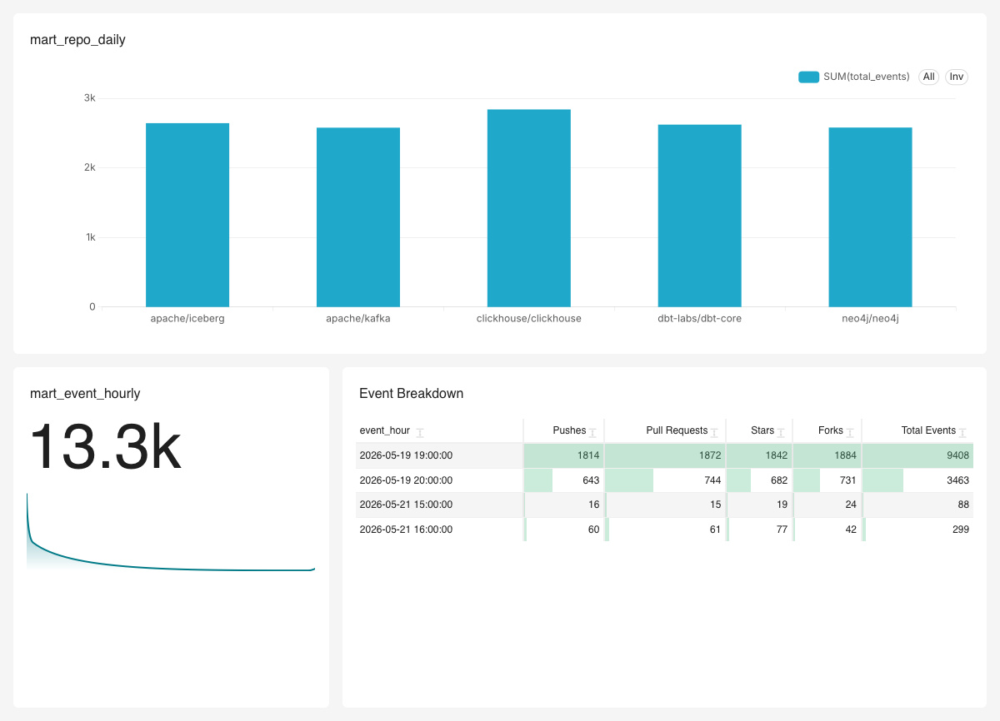

# oss-pulse — Open Source Ecosystem Intelligence Platform

A production-grade streaming data platform that ingests live GitHub events, stores them as Apache Iceberg tables on S3, transforms them with dbt, visualises them in Superset, models contributor relationships as a knowledge graph in Neo4j, and answers natural language questions across all systems using Claude as an intelligent query router.

Built as a learning project to demonstrate end-to-end data engineering across streaming, lakehouse, graph, and LLM technologies.

---

## Architecture

```
GitHub Events (mock)
        ↓
    Kafka + Confluent Schema Registry (Avro)
        ↓
PySpark Structured Streaming (30s micro-batch)
        ↓
Apache Iceberg on S3 (Parquet, partitioned by month)
        ↓ Lakekeeper REST catalog (metadata)
       ↙                          ↘
ClickHouse (OLAP)              Neo4j + GDS (graph)
       ↓                          ↓
  dbt (staging + marts)     PageRank / Louvain
       ↓                          ↓
  Superset (dashboards)     Claude tool router (NL queries)
```

---

## What it does

**Real-time ingestion** — A mock producer generates GitHub events (push, pull request, star, fork, issue) every 500ms and writes them to a Kafka topic in Avro format. The Confluent-compatible Schema Registry enforces BACKWARD compatibility on every schema change — breaking changes are caught at the producer before they ever reach Kafka.

**Streaming pipeline** — PySpark Structured Streaming consumes the Kafka topic in 30-second micro-batches, deserialises the Avro payload (stripping the 5-byte Confluent wire format header), and writes partitioned Parquet files to S3 via the Apache Iceberg format. Lakekeeper tracks every snapshot so the table supports time travel and schema evolution.

**Lakehouse storage** — Apache Iceberg sits on top of plain S3, giving the table database-like guarantees: atomic snapshot commits, schema evolution without rewriting files, time travel to any past snapshot, and hidden partitioning by month. ClickHouse reads Parquet files directly from S3 without copying data.

**Analytics layer** — dbt transforms raw events into clean staging views and mart tables inside ClickHouse. Marts include daily repo stats, contributor velocity with 7-day rolling averages, z-score anomaly detection, and hourly event breakdowns. Superset connects to ClickHouse and visualises the mart models as dashboards.

**Knowledge graph** — Neo4j models contributors and repos as a property graph. The Graph Data Science library runs PageRank to score repo influence, Louvain for community detection, and BFS for blast radius analysis. The graph is loaded from Iceberg via direct S3 Parquet reads.

**LLM query router** — Claude acts as an intelligent router across ClickHouse and Neo4j. It classifies the intent of a natural language question and generates the appropriate SQL or Cypher query. Analytics questions route to ClickHouse; relationship questions route to Neo4j. The router uses Claude's tool use API in an agentic loop — it executes queries, reads results, and synthesises a natural language answer.

---

## Stack

| Layer | Technology | Role |
|---|---|---|
| Ingestion | Apache Kafka 4.0 (KRaft) | Event buffer and durable log |
| Schema | Confluent Schema Registry | Avro schema versioning and compatibility |
| Serialisation | Apache Avro + fastavro | Binary wire format (5x smaller than JSON) |
| Processing | PySpark 3.5 Structured Streaming | Kafka → Iceberg micro-batch pipeline |
| Table format | Apache Iceberg 1.6 | Snapshots, time travel, schema evolution |
| Storage | AWS S3 | Parquet file storage |
| Catalog | Lakekeeper | Iceberg REST catalog (metadata in Postgres) |
| OLAP | ClickHouse 25.4 | Sub-second analytics on S3 Parquet |
| Transformation | dbt-core + dbt-clickhouse | Staging and mart model DAG |
| Visualisation | Apache Superset | BI dashboards on dbt marts |
| Graph | Neo4j 5.18 + GDS | Contributor and repo knowledge graph |
| LLM | Claude (Anthropic) | Natural language query routing |
| Data quality | Great Expectations | Batch validation before dbt runs |
| Language | Python 3.11 | Producer, Spark, Neo4j loader, Claude router |
| Infrastructure | Docker Compose | All services containerised |

---

## Services

| Service | Port | What it serves |
|---|---|---|
| Kafka | `19092` (external) / `9092` (internal) | Kafka broker |
| Schema Registry | `8081` | Avro schema API |
| Lakekeeper | `8181` | Iceberg REST catalog |
| ClickHouse | `8123` | HTTP query interface + Play UI |
| Neo4j Browser | `7474` | Visual graph explorer |
| Neo4j Bolt | `7687` | Driver connection |
| Superset | `8088` | BI dashboards |
| Kafka UI | `8090` | Topic and message browser |
| Postgres | `5432` | Lakekeeper catalog storage |

---

## Project structure

```
iceberg-lakehouse-ecosystem/
├── producer/
│   ├── mock_producer.py      ← Avro producer → Kafka
│   ├── Dockerfile
│   └── README.md
├── spark/
│   ├── streaming_job.py      ← PySpark Kafka → Iceberg
│   ├── Dockerfile
│   └── README.md
├── nexus_dbt/
│   ├── models/
│   │   ├── staging/
│   │   │   └── stg_github_events.sql
│   │   └── marts/
│   │       ├── mart_repo_daily.sql
│   │       ├── mart_contributor_stats.sql
│   │       └── mart_event_hourly.sql
│   ├── macros/
│   │   └── generate_schema_name.sql
│   └── dbt_project.yml
├── neo4j/
│   └── load_graph.py         ← Iceberg → Neo4j graph
├── claude/
│   └── router.py             ← NL → ClickHouse / Neo4j
├── gx/
│   └── validate.py           ← Great Expectations checks
├── schema/
│   └── github_events.json    ← Avro schema definition
├── clickhouse/
│   └── s3.xml                ← S3 credentials config
├── superset/
│   └── Dockerfile            ← clickhouse-connect baked in
├── docs/
│   ├── avro/README.md
│   ├── parquet/README.md
│   ├── kafka/README.md
│   ├── iceberg/README.md
│   └── neo4j/README.md
├── scripts/
│   ├── warehouse.sh          ← Lakekeeper bootstrap
│   └── register_schema.sh    ← Schema registry setup
├── docker-compose.yml
├── requirements.txt
└── .env                      ← never committed
```

---
### Superset Dashboard


## Quick start

**Prerequisites:** Docker Desktop, AWS account, Python 3.11, pyenv

**1. Clone and configure:**

```bash
git clone https://github.com/muhammadhrazzaq/iceberg-lakehouse-ecosystem
cd iceberg-lakehouse-ecosystem

cp .env.example .env
# Edit .env with your AWS credentials and Anthropic API key
```

**2. Start all services:**

```bash
docker compose up -d
docker compose ps   # wait until all show healthy
```

**3. Bootstrap Lakekeeper and register schema:**

```bash
./scripts/warehouse.sh
./scripts/register_schema.sh
```

**4. Install Python dependencies:**

```bash
pyenv virtualenv 3.11.9 iceberg-lakehouse-ecosystem
pyenv local iceberg-lakehouse-ecosystem
pip install -r requirements.txt
```

**5. Start the pipeline:**

```bash
# Terminal 1 — producer (if not running in Docker)
python producer/mock_producer.py

# Terminal 2 — Spark streaming (if not running in Docker)
python spark/streaming_job.py
```

Or run both in Docker:

```bash
docker compose up -d producer spark-streaming
docker compose logs -f producer spark-streaming
```

**6. Transform with dbt:**

```bash
cd nexus_dbt
dbt run
dbt test
```

**7. Load Neo4j graph:**

```bash
python neo4j/load_graph.py
```

**8. Run the Claude router:**

```bash
python claude/router.py
```

**9. Open dashboards:**

| UI | URL | Credentials |
|---|---|---|
| Superset | http://localhost:8088 | admin / admin123 |
| Neo4j Browser | http://localhost:7474 | neo4j / devpassword |
| ClickHouse Play | http://localhost:8123/play | default / nexus123 |
| Kafka UI | http://localhost:8090 | — |

---

## Environment variables

```bash
# .env
AWS_ACCESS_KEY_ID=your_key
AWS_SECRET_ACCESS_KEY=your_secret
AWS_REGION=eu-west-2
S3_BUCKET=your-bucket-name
LAKEKEEPER_DB_PASSWORD=devpassword
ANTHROPIC_API_KEY=sk-ant-your-key
```

---

## Key concepts demonstrated

**Confluent wire format** — every Kafka message carries a 5-byte header (magic byte + 4-byte schema ID) that links it to a versioned schema in the registry. PySpark strips this header before Avro deserialisation.

**Iceberg snapshot isolation** — every PySpark batch commits an atomic snapshot. Readers always see a consistent view even while new data is being written. Time travel queries any past snapshot by ID or timestamp.

**Hidden partitioning** — the Iceberg table is partitioned by `months(created_at)`. ClickHouse and PyIceberg prune irrelevant month partitions automatically without the partition column appearing in query syntax.

**dbt schema generation macro** — overrides dbt's default `{target_schema}_{model_schema}` concatenation behaviour so staging models land in `staging` and mart models land in `marts` rather than `marts_marts`.

**Agentic tool use loop** — the Claude router runs in a while loop: send question → model returns tool call → execute query → send result back → model synthesises answer. The loop continues until `stop_reason == "end_turn"`.

**Index-free adjacency** — Neo4j stores direct pointers between nodes. A 5-hop graph traversal costs O(degree) not O(table size). The same query in SQL would require 5 self-joins that grow exponentially with data size.

**BACKWARD schema compatibility** — new Avro schemas must be readable by the existing PySpark consumer. Adding a field requires a default value. The registry rejects breaking changes before they reach Kafka.

---

## Data flow timing

```
T+0s    Producer sends event to Kafka
T+30s   PySpark reads batch, writes Parquet to S3
T+30s   Lakekeeper commits new Iceberg snapshot
T+30m   dbt runs, transforms raw → marts
T+30m   Superset refreshes dashboard cache
T+∞     Neo4j can be reloaded any time from Iceberg
T+∞     Claude router queries live ClickHouse + Neo4j
```

---

## Docs

Each technology has a dedicated README explaining core concepts, architecture decisions, and how it fits into the pipeline:

- [`docs/avro/README.md`](docs/avro/README.md) — Avro format, Confluent wire format, schema evolution
- [`docs/parquet/README.md`](docs/parquet/README.md) — columnar storage, compression, predicate pushdown
- [`docs/kafka/README.md`](docs/kafka/README.md) — topics, offsets, KRaft mode, listener config
- [`docs/iceberg/README.md`](docs/iceberg/README.md) — snapshots, time travel, hidden partitioning
- [`docs/neo4j/README.md`](docs/neo4j/README.md) — property graph, Cypher, GDS algorithms, graph RAG
- [`spark/README.md`](spark/README.md) — Structured Streaming, micro-batch, checkpoint semantics
- [`producer/README.md`](producer/README.md) — Avro serialisation, schema registry integration
